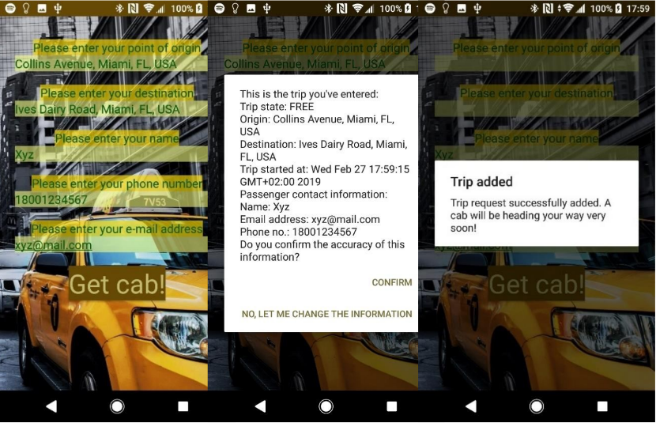

# Get Cab
Free adaptation of the Gett android app.

Screenshots of the app:

This app uses Firebase realtime database (NoSQL) to store the information on requested trips and registered cabbies. It should be divided by trips (where newly created Trip objects will be sent/stored) and cabbies (where newly added cabbie accounts - i.e. Cabbie objects - will be sent/stored/verified).
Make sure to have such a database and to include its google-service.json file on the project folders.

As with most android projects that were created longer than a few minutes ago, many of these projects' dependencies may be (and probably are) deprecated/no longer in use, so it's probably a good idea to check for updates in the build gradles. I will try to update it when possible, but until then...
